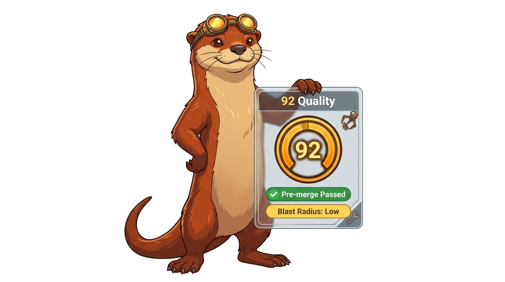
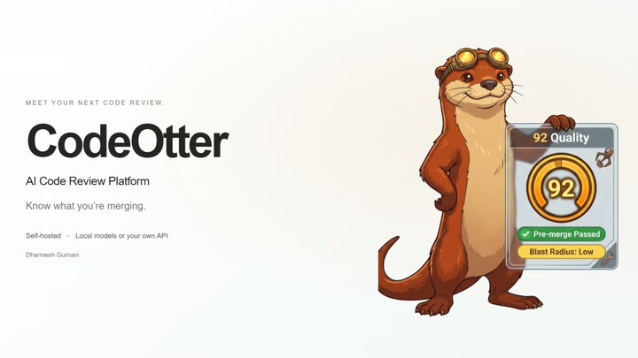
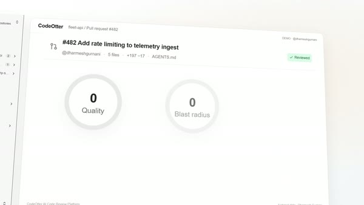
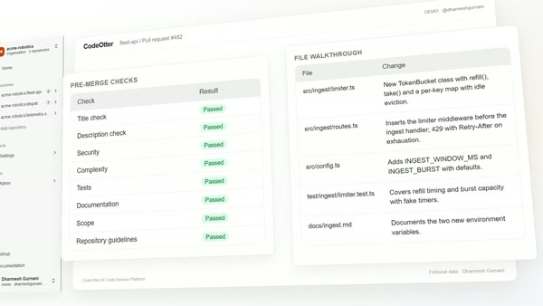
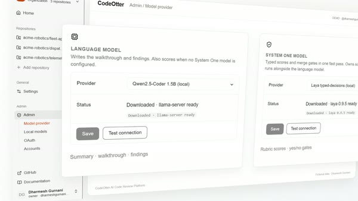
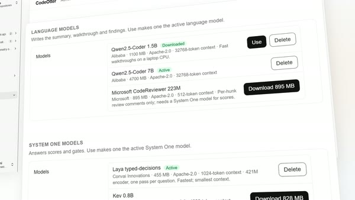
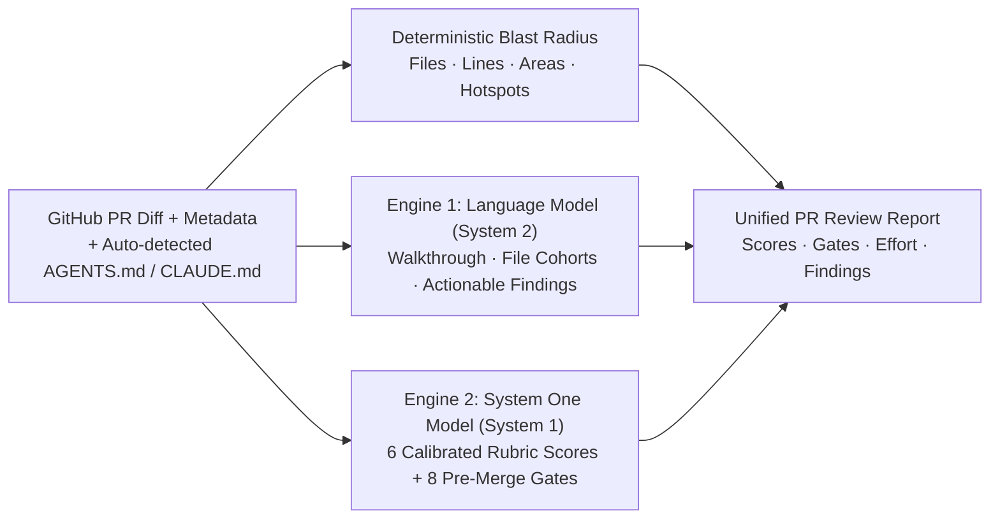

<div align="center">

<p align="center">
  
</p>

# 🦦 CodeOtter

### Autonomous, self-hosted AI code reviews, calibrated scoring gauges, and merge gates — running on your own hardware with any open model.

<p align="center">
  <a href="https://codeotter.io"><strong>Website</strong></a> &middot;
  <a href="https://codeotter.io/docs/"><strong>Docs</strong></a> &middot;
  <a href="#-quickstart"><strong>Quickstart</strong></a> &middot;
  <a href="#what-is-codeotter"><strong>What is CodeOtter</strong></a> &middot;
  <a href="#-how-it-works-the-dual-engine"><strong>Dual Engine</strong></a> &middot;
  <a href="#-100-offline-mode-zero-cloud"><strong>Offline Mode</strong></a> &middot;
  <a href="#-docker-deployment"><strong>Docker</strong></a> &middot;
  <a href="#-security--privacy"><strong>Security & Privacy</strong></a> &middot;
  <a href="#-star-history"><strong>Star History</strong></a>
</p>

<p align="center">
  <a href="https://github.com/dharmeshgurnani/CodeOtter/actions/workflows/ci.yml"></a>
  <a href="https://codeotter.io"></a>
  <a href="LICENSE"></a>
  <a href="package.json"></a>
  <a href="#-security--privacy"></a>
  <a href="#what-is-codeotter"></a>
  <a href="#-100-offline-mode-zero-cloud"></a>
  <a href="https://star-history.com/#dharmeshgurnani/CodeOtter&Date"></a>
</p>

</div>

---

## What is CodeOtter?

**CodeOtter** is a free-to-self-host pull request review platform built for engineering teams who want calibrated code intelligence without sending private code to third-party SaaS clouds or paying **$24–$30/developer/month**.

Run it **100% offline** on your workstation with open-weight Hugging Face models (`llama.cpp` + `ggmlc` sidecars), or connect your own keys for Claude, OpenAI, MiniMax, or OpenRouter.

<p align="center">
  <a href="assets/videos/codeotter-cinematic-film-silent.mp4"><picture><source srcset="assets/videos/hero-showcase.gif" type="image/gif"></picture></a>
</p>

---

## Features

<table>
<tr>
<td width="50%" valign="middle">

### Side-by-Side 30/70 Review Dashboard

Inspect calibrated **0–100 score gauges** (`Quality`, `Blast Radius`, `Risk`, `Tests`, `Readability`, `PR Hygiene`) on the left while reading the streaming **Markdown review terminal**, interactive **Architecture & Blast Radius Mermaid diagram** (100% offline SVG flowchart renderer with raw Mermaid source toggle), cohort file walkthroughs, and severity-ranked findings on the right. Re-run scores or narrative independently with one click.

[Quickstart →](#-quickstart)

</td>
<td width="50%">
  <a href="assets/videos/codeotter-cinematic-film-silent.mp4"><picture><source srcset="assets/videos/tile-review-dashboard.gif" type="image/gif"></picture></a>
</td>
</tr>
<tr>
<td width="50%" valign="middle">

### Deterministic System 1 Scores &amp; Merge Gates

Standard LLM prompts hallucinate numbers. CodeOtter pairs your language model with a **System 1 decision engine** (`POST /v1/systemone`) that evaluates **6 rubric scores** and **8 yes/no pre-merge gates** (`Title`, `Description`, `Security`, `Complexity`, `Tests`, `Docs`, `Scope`, `Guidelines`) in a single fast pass.

[Dual Engine Architecture →](#-how-it-works-the-dual-engine)

</td>
<td width="50%">
  <a href="assets/videos/codeotter-cinematic-film-silent.mp4"><picture><source srcset="assets/videos/tile-system-one.gif" type="image/gif"></picture></a>
</td>
</tr>
<tr>
<td width="50%" valign="middle">

### 100% Offline Local Models

Download open-weight GGUF and CodeT5 checkpoints directly from Hugging Face inside **Admin → Local models**. CodeOtter automatically manages `llama-server` (`llama.cpp`), `laya` (`ggmlc`), and Python sidecars with discrete Vulkan/Metal GPU detection.

[Offline Mode →](#-100-offline-mode-zero-cloud)

</td>
<td width="50%">
  <a href="assets/videos/codeotter-cinematic-film-silent.mp4"><picture><source srcset="assets/videos/tile-local-models.gif" type="image/gif"></picture></a>
</td>
</tr>
<tr>
<td width="50%" valign="middle">

### `AGENTS.md` / `CLAUDE.md`, Repo Learnings, Inline `suggestion` Fixes, Incremental Delta Reviews &amp; GitHub PR Sync

Automatically detects `AGENTS.md` and `CLAUDE.md` at the root of each onboarded repository to enforce team rules on every diff hunk. Features **Smart Context Outside-Diff Call Graph Impact Slicing** (automatically extracts modified function, method, and class symbols across the diff and scans repository files outside the diff for callers/importers, ensuring changes never silently break un-modified call sites in production). **Dynamic context**: each code hunk is extended upward to its enclosing function, method or class (up to 16 lines, read from the PR head; Admin → Model provider → Review → Context above a change) and trailing context is cut to one line, so models see the signature a change lives in without paying for lines below it. **Large pull requests** are not cut at a character count: when the diff exceeds the budget, files in the main language go first, then other code, then docs and config, then lockfiles and generated output; a file too big to fit shows its leading hunks (at most half the budget), hunks that only delete lines are dropped, and every file left out is still named with its line counts. **Self-check**: after a language model review, a second pass of the same model scores each finding 0-10 against the diff and drops those below the configured minimum (default 5; Admin → Model provider → Review → Self-check); the score shows on each finding. **Tools** (card under the review): **Describe** writes the PR title, type, summary and per-file changes; post it as a comment or apply it to the PR description (CodeOtter's block is replaced on each run, the author's text is kept). **Ask** answers a question about the PR from its diff, naming files and lines, and says what is missing rather than guessing. **Improve** returns ranked code suggestions (each replacing a line range, labelled possible issue, security, performance…), filtered by the self-check, and posts them as committable inline suggestions, multi-line on GitHub. **Docs** suggests doc comments for new or changed functions and classes in the language's convention, as committable suggestions. **Changelog** drafts an entry in the format of the repository's own CHANGELOG.md, CHANGES.md or HISTORY.md. **PR comment commands** (off by default; Admin → Model provider → Review): a comment starting with `/review`, `/describe`, `/improve`, `/ask <question>`, `/docs` or `/changelog` from the repository's owner, members or collaborators runs it within a minute and replies on the pull request. **Accepted fixes**: when a re-review finds that the author applied a CodeOtter suggestion since the last review, the fix is remembered for the repository (Settings → Repositories → ⚙️) and later reviews look for the same kinds of problems. Findings include line-level `:L<line>` anchors and exact `suggestion` code replacements rendered as interactive **Suggested Fix** cards with 1-click **"Copy fix"** and **"Post inline suggestion to GitHub"** (`POST /api/review-suggestions`), posting committable ` ```suggestion ` blocks directly onto the pull request diff line so authors can click **"Commit suggestion"** on GitHub. Dismiss any review finding with **1-click ("Dismiss & remember rule")** to persist a repository team learning that is automatically injected into future LLM and System 1 review prompts (and managed under **Settings → Repositories → ⚙️**). Re-reviewing a pull request performs an **incremental commit-by-commit delta review** (`prevSha → headSha`), inspecting new commits and tracking resolved prior findings. Enable **Post scores on PR**, **Add PR review as a comment**, and **Post inline suggestions** to publish and **update in-place (upsert)** formatted scorecards, review summaries, and inline committable fixes on GitHub pull requests.

[Security &amp; Privacy →](#-security--privacy)

</td>
<td width="50%">
  <a href="assets/videos/codeotter-cinematic-film-silent.mp4"><picture><source srcset="assets/videos/tile-github-sync.gif" type="image/gif"></picture></a>
</td>
</tr>
</table>

---

## Supported Models &amp; Providers

Works with **any local open-weight model or hosted API** — mix and match System 1 and System 2 engines freely.

<p>
  <a href="https://huggingface.co/Anthropic"><kbd> Claude Opus / Sonnet</kbd></a> &nbsp;
  <a href="https://huggingface.co/openai"><kbd> OpenAI GPT-5</kbd></a> &nbsp;
  <a href="https://huggingface.co/Qwen"><kbd> Qwen2.5-Coder (1.5B / 7B)</kbd></a> &nbsp;
  <a href="https://huggingface.co/MiniMaxAI"><kbd> MiniMax-M3</kbd></a> &nbsp;
  <a href="https://huggingface.co/deepseek-ai"><kbd> DeepSeek-Coder / V3</kbd></a> &nbsp;
  <a href="https://huggingface.co/meta-llama"><kbd> Llama 3.1 / 3.3</kbd></a> &nbsp;
  <a href="https://huggingface.co/microsoft/codereviewer"><kbd> Microsoft CodeReviewer</kbd></a> &nbsp;
  <a href="https://huggingface.co/mys/laya-typed-decisions-GGUF"><kbd> Laya Typed-Decisions</kbd></a> &nbsp;
  <a href="https://huggingface.co/mys/kev-0.8b-GGUF"><kbd> Kev 0.8B (S1)</kbd></a> &nbsp;
  <a href="https://console.typesafe.ai"><kbd> TypeSafe Jev</kbd></a> &nbsp;
  <a href="https://openrouter.ai/cloudflare/clef"><kbd> Cloudflare Clef</kbd></a> &nbsp;
  <a href="https://ollama.com"><kbd> Ollama</kbd></a> &nbsp;
  <a href="https://openrouter.ai"><kbd> OpenRouter</kbd></a> &nbsp;
  <kbd>+ any OpenAI-compatible or local GGUF endpoint</kbd>
</p>

---

## CodeOtter is right for your team if

- ✅ You want **enterprise-grade PR reviews** without sending private code to a third-party cloud
- ✅ You want **calibrated 0–100 scores and deterministic gates**, not hallucinated guesses
- ✅ You want to **enforce team conventions** (`AGENTS.md` / `CLAUDE.md`) automatically on every PR
- ✅ You want to run **100% offline on local hardware** (MacBook, Linux workstation, air-gapped GPU)
- ✅ You want **zero per-seat billing** ($0 forever for self-hosting)
- ✅ You want an **instant, zero-dependency deployment** with Docker or lightweight Node

---

## ⚡ Quickstart

### Local Setup (Requires Node 22+ & pnpm)

For GitHub repositories, authenticate the **GitHub CLI (`gh`)** (`gh auth status`). Forgejo uses its REST API and does not require `gh`:

```bash
# 1. Clone the repository
git clone https://github.com/dharmeshgurnani/CodeOtter.git
cd CodeOtter

# 2. Launch with a single command
pnpm dev      # Development: starts Backend, PocketBase, and Vite dev server with HMR (:5173 -> :4747)
# or
pnpm start    # Production: auto-builds frontend if needed and runs CodeOtter on http://localhost:4747
```

Open **`http://localhost:5173`** (dev mode) or **`http://localhost:4747`** (production) in your browser:
1. Paste a GitHub or configured Forgejo/Gitea PR URL or select from your active repositories in the sidebar.
2. Select your AI provider under **Settings → Model provider** (or download a 100% offline local model under **Admin → Local models**).
3. Get a calibrated review report in seconds—or query `/api/score?pr=<url|number>` for JSON.

> **Zero-Config Storage**: PocketBase is auto-detected and started locally for authentication and persistent storage. To customize superuser credentials or model keys, create a `.env` file (see `.env.example`).

### Forgejo repositories and sign-in

GitHub and one Forgejo server can coexist in the same installation. Sign-in and repository credentials are independent: GitHub-only teams, Forgejo-only teams, and teams signing in with GitHub while reviewing Forgejo repositories are supported.

1. Open **Admin → OAuth → Forgejo connection**. Save the server origin (for example `https://forgejo.example.com`) and an access token; select **Test connection**. Use a repository-scoped token with `read:repository` and `read:issue` to review, or `read:user`, `write:repository` and `write:issue` to also publish review comments/suggestions. The token account must have access to the repositories. Environment defaults are `FORGEJO_URL` and `FORGEJO_TOKEN`.
2. For Forgejo sign-in, create an OAuth2 application in your Forgejo **Settings → Applications**. Register the callback displayed in **CodeOtter Admin → OAuth**, typically `https://codeotter.example.com/auth/callback`. Save its client ID and secret in the **Forgejo** section and enable it. Set `APP_URL` to CodeOtter's public address. GitHub OAuth can remain enabled or be disabled independently. PocketBase is required for sign-in.
3. Add the full Forgejo repository URL in **Settings → Repositories**. Within a Forgejo organization, plain `owner/name` also selects Forgejo. Discovery uses the saved access token; OAuth login by itself does not grant the shared review service repository access. GitHub repository credentials still come from `gh`/`GH_TOKEN`.
4. Select the organization marked **Forgejo**, open a PR, and review it with the same models and controls used for GitHub. Score/review comment posting and inline suggestions use the configured Forgejo token account.

Existing GitHub repository IDs and review data are unchanged. Forgejo repository IDs use `forgejo~owner/name` internally, and API organization scopes use `?org=forgejo~owner`. PR URLs retain the real Forgejo host and `/pulls/123` path. Repository settings and learned rules remain separate even when both platforms have an `owner/name` with the same spelling.

OAuth uses PKCE and single-use, expiring server-side state. Accounts without a provider-verified email are identified by their OAuth provider and subject. Password sign-in and public password-based account creation are disabled. Blank secrets preserve saved values; disabling an OAuth provider removes its credentials without changing the other provider. Changing the Forgejo origin is blocked while repository/review or OAuth configuration is linked.

This first integration targets Forgejo 15. Server origins with subpaths are not supported. Forgejo reviews use the full PR diff plus commit history for re-reviews; they do not claim an incremental patch when the API does not supply one. Outside-diff GitHub code search/local-checkout analysis is not run against Forgejo repositories. Gitea uses the same review adapter with separate credentials and identities; see below.

### Gitea repositories and sign-in

GitHub, Forgejo and Gitea can all coexist. Each self-hosted provider supports one server origin; Forgejo and Gitea must have distinct origins, access tokens and OAuth applications. Existing Forgejo IDs and OAuth identities remain unchanged.

1. In **Admin / OAuth / Gitea connection**, save the server origin and repository access token, then select **Test connection**. Environment defaults are `GITEA_URL` and `GITEA_TOKEN`. Use `read:repository` and `read:issue` for reviews; add `read:user`, `write:repository` and `write:issue` for posting comments and suggestions.
2. Create a Gitea OAuth2 application under **Settings / Applications**, using the callback shown in **CodeOtter Admin / OAuth**. Save its client ID and secret in the **Gitea** section and enable it. PocketBase's dedicated Gitea provider uses PKCE and requests `read:user` and `user:email`; only verified primary email is used for account linking.
3. Add the full Gitea repository URL under **Settings / Repositories**. Select the organization marked **Gitea**. Internal IDs use `gitea~owner/name`; sign-in provider and repository access remain independent.

Validated against Gitea 1.24.6. The same full-diff re-review and outside-diff analysis limits described for Forgejo apply. Server URLs with subpaths are unsupported. Changing a server origin is blocked while repositories, reviews, OAuth configuration or saved OAuth identities depend on it.


### Integration tests

```bash
pnpm -C web build
pnpm test:forgejo
pnpm test:gitea
# Keep a disposable installation running for browser QA:
node scripts/test-forges.mjs --gitea --serve
```

The suite requires Docker and `.pb/pocketbase` (`.pb/pocketbase.exe` on Windows), or `TEST_PB_BIN`. The suites start Forgejo 15, Gitea 1.24.6 and PocketBase with disposable data, use a deterministic local model, and never write to the running CodeOtter installation. They cover each provider separately and all three together, including real self-hosted OAuth, token isolation, identical repository names, fork PRs, comment upserts and both storage modes. GitHub CLI and OAuth responses are fixtures; real GitHub OAuth credentials are not used.

---

## 📟 Native `codeotter` CLI &amp; CI Runner

CodeOtter has one CLI with an interactive Blessed TUI and scriptable review, CI, JSON and MCP modes. Requires Node 22 or later. Run `pnpm install --frozen-lockfile`, then `pnpm tui`. With no arguments, `codeotter` opens the TUI in an interactive terminal; `codeotter review --json` remains suitable for coding agents.

The default TUI groups all connected repositories under expandable organizations. Selecting a repository scopes its PRs; moving between PRs immediately updates scores, summary and full details. Saved reviews appear immediately, and missing reviews calculate sequentially using the web app's configured engines. Reviews share the same storage. The TUI does not publish comments or suggestions.

**No running web server is required.** The TUI imports shared services from `core/server.mjs` without binding a port, building the frontend or starting scheduled automation. Forge APIs and hosted models still require network access. PocketBase is auto-managed where configured; locally started storage survives terminal closure and retries refused reads once, without replaying writes. Web authentication, permissions and organization scoping are unchanged.

Configuration defaults to the repository that holds `core/server.mjs`. Set `CODEOTTER_HOME` to an existing installation to use its `.env`, `config.json`, `scores/`, `.pb`, `pb_data` and default `.local` directory. Explicit `PB_URL` and `PR_SCORER_DATA` take precedence.

Scores use the web app's green/amber/red thresholds, inverted for risk and blast radius. Full details contains gates, findings and a folder-tree walkthrough. The underlined orange PR link opens in your browser; **Copy as prompt** copies plain text without added instructions. Clipboard copying uses OS tools, with OSC 52 forwarding as a sandbox fallback where supported.

The **Changes** tab uses optional [Delta](https://github.com/dandavison/delta) for real PR diffs, syntax highlighting, old/new line numbers and gutter-preserving wrapping. Install `git-delta` separately (Windows: `winget install dandavison.delta`; macOS: `brew install git-delta`), or set `CODEOTTER_DELTA` to its executable. Nothing downloads automatically; the rest of the TUI works without Delta.

The header uses `web/public/favicon.svg` on SIXEL-capable terminals, with an emoji fallback. Set `CODEOTTER_IMAGE=off` to disable images; run `pnpm build:tui-icon` after changing the SVG. Brand orange accents and borders stay consistent; yellow marks active selection and focus. Ordinary review views omit model/provider identities.

| Key | Action |
| --- | --- |
| `Tab` / `Shift+Tab` | Cycle repositories, PRs, Review and Changes forward/backward |
| Arrows / `Enter` | Navigate and select; expand/collapse organizations |
| Left / Right in details | Switch Review/Changes tabs |
| `PgUp` / `PgDn` | Scroll full details or changes |
| `c` / `o` | Copy content / open the PR |
| `g` / `r` | Refresh / recalculate the selected PR |
| `Esc` | Return from Changes or stop the review queue |
| `q` / `Ctrl-C` | Quit |

Use `codeotter tui --local` for staged/unstaged/base/patch review, Ask, description/improvement/docs/changelog drafts, session settings, history and JSON export. Press `?` for local-mode keys. It uses provider environment variables or `--provider`, `--model`, `--base-url` and `--key`, with a 35,000-character diff context. Use a terminal at least 60 columns wide and 20 rows tall. Onboarding, accounts/OAuth, model downloads and publishing controls remain in the web app.

```bash
# Browse connected repositories using the shared local backend
node tui/codeotter.mjs tui

# Print a one-shot review with color gauges & walkthrough
node tui/codeotter.mjs review

# Review staged changes before git commit
node tui/codeotter.mjs --staged

# Review PR and post scorecard comment
node tui/codeotter.mjs pr 42 --post-comment

# Run in CI as a merge blocker (exits with code 1 if gates fail or score < 60)
node tui/codeotter.mjs ci --fail-on-gate --min-score 60

# Run Model Context Protocol (MCP) server for Cursor / Claude Desktop / IDEs
node tui/codeotter.mjs mcp
```

### Key CLI Features:
- **Anti-Hallucination Critique Pass**: Automatically filters out false positives and ungrounded nitpicks by cross-verifying findings against the diff hunks.
- **Smart Context**: Scans for outside callers and evaluates cross-file contract safety.
- **Pre-Merge Gates**: Validates title, description, security, complexity, tests, documentation, and `AGENTS.md` / `CLAUDE.md` guidelines.
- **Offline or BYOK**: Works with local `llama.cpp` / Ollama or hosted API keys (Anthropic, OpenAI, Gemini, MiniMax, Groq, OpenRouter).

---

## 🧠 How It Works: The Dual Engine

<p align="center">
  
</p>

Asking a single chat LLM to both generate nuanced code critiques *and* output calibrated numeric scores fails in practice: chat models cluster every score between `75` and `85` and significantly slow down generation.

CodeOtter separates review into **two specialized engines that run concurrently**:



### 1. Language Model (System 2 — Prose & Cohorts)
Produces the human-readable review narrative:
- **Executive Walkthrough**: High-level context of what changed, commit progression, and linked issue requirement validation (`Closes #123`, `Fixes #456`).
- **File Cohorts**: Groups related file modifications into logical review units.
- **Actionable Findings**: Severity-ranked issues (`⚠️ High / Major`, `⚠️ Medium / Minor`, `🛠️ Low / Refactor`, `🧹 Nitpick`).

### 2. System One Model (System 1 — Typed Scores & Merge Gates)
Evaluates structured rubrics and merge-policy criteria in a single lightning-fast pass:
- **6 Calibrated Scores (`0–100`)**: `Quality`, `Blast Radius`, `Correctness Risk`, `Test Coverage`, `Readability`, and `PR Hygiene`.
- **9 Pre-Merge Policy Gates**: `Title check`, `Description check`, `Security` (injection, auth bypass, secrets, SSRF, XSS), `Complexity`, `Tests`, `Documentation`, `Scope`, `Repository guidelines` (`AGENTS.md` / `CLAUDE.md` compliance), and `Issue requirements` (validates diff against linked GitHub issue acceptance criteria).

*Both engines run in parallel; reviews take only as long as the slowest pass. Either engine can also operate standalone.*

### Auto-review
Turn on **Auto-review** under **Admin / Model provider / Review** and every new or updated pull request in an onboarded repository gets a full review with scores and the review comment posted, one PR at a time, on the same poll as triage. Drafts and PRs labelled `codeotter:skip` are skipped; each head commit is reviewed once.

### Fast triage: stop the pipeline early
System One rates each new or updated pull request's correctness risk and blast radius from a digest of the whole change and sets the `codeotter/triage` commit status, about 80 seconds on CPU with Kev 0.8B. A GitHub Actions job waits for it: red stops the long build, green lets it run. Turn it on under **Admin / Model provider / Fast triage**; workflow in [docs/ci-triage.md](docs/ci-triage.md). If System One fails, the status is `error` with the reason, never a guessed score.

---

## 💻 100% Offline Mode (Zero Cloud)

<p align="center">
  
</p>

Review proprietary code on an airplane or within an air-gapped data center with **zero network requests leaving your machine**.

With 1-click downloads directly from **Admin → Local models**, open-weight models download with optimized local runtimes:

| Model | Engine Role | Ideal For | Hugging Face |
| :--- | :--- | :--- | :--- |
| **Laya Typed-Decisions** | System 1 (Scores & Gates) | Instant rubric scoring & gate checks | [`mys/laya-typed-decisions-GGUF`](https://huggingface.co/mys/laya-typed-decisions-GGUF) |
| **Kev** | System 1 (Scores & Gates) | High-confidence decision calibration | [`mys/kev-0.8b-GGUF`](https://huggingface.co/mys/kev-0.8b-GGUF) |
| **Kev 4B** | System 1 (Scores & Gates) | Most accurate local scoring, best with a GPU | [`mys/kev-4b-GGUF`](https://huggingface.co/mys/kev-4b-GGUF) |
| **Qwen2.5-Coder (Compact)** | System 2 (Prose & Walkthrough) | Fast local walkthroughs on laptops | [`Qwen/Qwen2.5-Coder-1.5B-Instruct-GGUF`](https://huggingface.co/Qwen/Qwen2.5-Coder-1.5B-Instruct-GGUF) |
| **Qwen2.5-Coder (Standard)** | System 2 (Prose & Walkthrough) | In-depth code critiques & findings | [`Qwen/Qwen2.5-Coder-7B-Instruct-GGUF`](https://huggingface.co/Qwen/Qwen2.5-Coder-7B-Instruct-GGUF) |
| **Microsoft CodeReviewer** | System 2 (Hunk Findings) | Specialized diff-hunk comment generation | [`microsoft/codereviewer`](https://huggingface.co/microsoft/codereviewer) |

- **Smart Resource Management**: Local model runtimes spin up on-demand on the first review and automatically shut down after **15 idle minutes** to conserve memory and battery.
- **Hardware Acceleration**: Automatic GPU detection with seamless CPU fallback ensures smooth execution on everything from developer laptops to dedicated servers.
- **Intelligent Context Optimization**: Diffs and questions are dynamically formatted to match model context windows for high-speed, reliable local inference.

---

## 🛡️ Auto-Detected `AGENTS.md` & `CLAUDE.md` Enforcement

<p align="center">
  
</p>

Every repository onboarded in CodeOtter is automatically inspected at its root via its forge API for `AGENTS.md` and/or `CLAUDE.md`.
- **Zero Configuration**: When either (or both) files exist, team guidelines are automatically injected into the review context.
- **Enforced at the Merge Gate**: Violations of architecture conventions, file structures, or coding guidelines trigger warnings in the `Repository guidelines` merge gate.
- **Per-Repository Controls**: Toggle guideline enforcement per repository anytime with a single click.

---

## 🐳 Docker Deployment

A production-ready Docker container packages the complete CodeOtter platform—including persistent storage, team auth, and model runners. Deploy anywhere that runs a container (Docker Compose, Railway, Fly.io, Render, Coolify, or a bare VPS).

### One-click deploy

[](https://portal.azure.com/#create/Microsoft.Template/uri/https%3A%2F%2Fraw.githubusercontent.com%2Fdharmeshgurnani%2FCodeOtter%2Fmain%2Fdeploy%2Fazure.json)
[](https://render.com/deploy?repo=https://github.com/dharmeshgurnani/CodeOtter)

Any Linux VPS (DigitalOcean, Hetzner, Vultr, Linode, EC2, your own hardware), as root:

```bash
curl -fsSL https://raw.githubusercontent.com/dharmeshgurnani/CodeOtter/main/install.sh | bash
# With HTTPS: point a DNS A record at the server first
curl -fsSL https://raw.githubusercontent.com/dharmeshgurnani/CodeOtter/main/install.sh | CODEOTTER_DOMAIN=review.example.com bash
```

The same line works as cloud-init user data when creating the server. It installs Docker, writes `/opt/codeotter/.env` with a generated PocketBase password, and starts CodeOtter with Watchtower updates. With `CODEOTTER_DOMAIN` it also runs [Caddy](https://caddyserver.com) with a Let's Encrypt certificate and keeps ports 4747 and 8090 on loopback. Re-running it keeps `.env`.

- **Azure** creates an Ubuntu VM with HTTPS on `https://<label>.<region>.cloudapp.azure.com`. Only an SSH public key is required.
- **Render** needs a paid instance type, because only paid instances keep a disk. Render does not follow `:latest`, so redeploy to update.
- Sign in right after deploying: the first account becomes the owner.

### Compose

```bash
# 1. Prepare environment
cp .env.example .env       # Set GH_TOKEN and optional model keys

# 2. Launch with Compose (pulls ghcr.io/dharmeshgurnani/codeotter)
docker compose up -d       # Dashboard available on http://localhost:4747
```

**Updates are automatic.** Every release tag publishes `ghcr.io/dharmeshgurnani/codeotter` as `:latest`, `:X.Y.Z` and `:X.Y` (amd64 and arm64). The Compose file runs [Watchtower](https://github.com/nicholas-fedor/watchtower) next to CodeOtter: it checks hourly, pulls a newer image and restarts only the CodeOtter container. `pb_data` stays on its volume and PocketBase applies new migrations on start.

- Hold back: pin `image: ghcr.io/dharmeshgurnani/codeotter:0.6` (patch releases only) or `:0.6.0` (frozen). Roll back the same way.
- Update by hand instead: delete the `watchtower` service, then `docker compose pull && docker compose up -d`.
- Admins see **vX.Y.Z available** in the sidebar when a newer release exists (checked against GitHub Releases every 6 hours). `CODEOTTER_UPDATE_CHECK=0` turns the check off.

Or build and run standalone:

```bash
docker build -t codeotter .
docker run -d -p 4747:4747 -p 8090:8090 --env-file .env -v codeotter-data:/app/pb_data codeotter
```

- `GH_TOKEN` authenticates `gh` inside the container without interactive prompts.
- Mount `/app/pb_data` as a volume to persist reviews, settings, and downloaded local models across upgrades.

---

## 🏢 Multi-Organization & Team Management

<table>
<tr><td width="30%"><b>Organization Scoping</b></td><td>Switch between teams and organizations seamlessly from the header dropdown. All dashboards, open PR queues, and settings remain isolated.</td></tr>
<tr><td><b>1-Click GitHub App Setup</b></td><td>Under <b>Admin → OAuth</b>, click <i>"Create GitHub app for me"</i> to configure OAuth credentials automatically in one step.</td></tr>
<tr><td><b>Role-Based Access (RBAC)</b></td><td>Owner, Admin, and Developer tiers safeguard sensitive model keys and organization settings. The first user to sign in automatically becomes the instance Owner.</td></tr>
<tr><td><b>Zero-Restart Configuration</b></td><td>All provider keys, local models, and repository settings update live through the dashboard without restarting services.</td></tr>
</table>

---

## 🔒 Security & Privacy

- **Zero Telemetry / No Middleman**: Code diffs and metadata never leave your network unless you explicitly configure a hosted AI provider. Zero analytics, zero phone-home calls.
- **Calibrated & Sanitized Outputs**: Model responses are validated, normalized, and sanitized before display, eliminating prompt injections and hallucinated scores.
- **Hardened Access**: Enterprise-grade session security, strict cross-origin protections, and masked credential management protect your infrastructure and repositories.

---

## ⭐ Star History

<p align="center">
  <a href="https://star-history.com/#dharmeshgurnani/CodeOtter&Date">
    <picture>
      <source media="(prefers-color-scheme: dark)" srcset="https://api.star-history.com/svg?repos=dharmeshgurnani/CodeOtter&type=Date&theme=dark" />
      <source media="(prefers-color-scheme: light)" srcset="https://api.star-history.com/svg?repos=dharmeshgurnani/CodeOtter&type=Date" />
      
    </picture>
  </a>
</p>

---

## 📄 License & Community

- **License**: Distributed under the [Elastic License 2.0 (ELv2)](LICENSE) — free to self-host and customize.
- **Contributing**: Contributions and feedback are welcome! Please check out [`CONTRIBUTING.md`](CONTRIBUTING.md) to get started.
