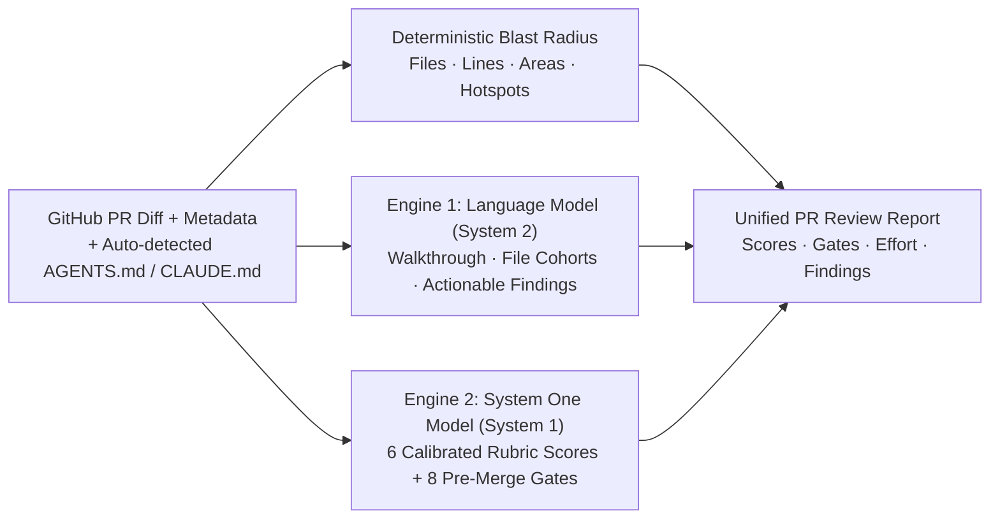

<div align="center">


# 🦦 CodeOtter (`pr-scorer`)

**CodeRabbit-grade pull request reviews, blast-radius scoring, and merge gates — running on your own machine with any open model.**

[](LICENSE)
[](package.json)
[](server.mjs)
[](models.json)
[](design.md)

[Quickstart](#-30-second-quickstart) · [How the Dual Engine Works](#-why-two-ai-engines-system-1--system-2) · [100% Offline Mode](#-100-offline-local-models-zero-api-keys) · [Docker](#-docker-one-container) · [Settings & RBAC](#-settings--multi-org-architecture)

</div>

---

## Why CodeOtter?

Hosted AI code-review bots (**CodeRabbit, Greptile, Cursor Bugbot**) are great at summarizing pull requests—until you look at the **$24–$30/developer/month** invoice, the third-party SaaS read access to your private codebase, or the vendor lock-in.

On the other hand, wiring a raw LLM prompt to `git diff` produces walls of uncalibrated prose and hallucinated 85/100 scores.

**CodeOtter** (`pr-scorer`) gives your team the exact UX of a top-tier review bot—**file-by-file cohort walkthroughs, 6 calibrated score gauges, deterministic blast-radius analysis, pre-merge check gates, and actionable findings**—self-hosted in **one dependency-free Node file** and a fast React + Animate UI console.

```text
┌──────────────────────────────────────────────────────────────────────────────┐
│ codeotter bot commented · Reviewed in 6.4s                                   │
├──────────────────────────────────────────────────────────────────────────────┤
│ Walkthrough                                                                  │
│ Splits review scoring into parallel System 1 (typed rubrics + merge gates)   │
│ and System 2 (cohort walkthrough + actionable findings) passes.              │
│                                                                              │
│ Estimated code review effort: 🎯 3 (Moderate) | ⏱️ ~15 minutes               │
│                                                                              │
│   ╭──────╮    ╭──────╮    ╭──────╮    ╭──────╮    ╭──────╮    ╭──────╮       │
│   │  88  │    │  25  │    │  18  │    │  75  │    │  92  │    │  84  │       │
│   ╰──────╯    ╰──────╯    ╰──────╯    ╰──────╯    ╰──────╯    ╰──────╯       │
│   Quality    Blast Rad.     Risk       Tests     Readability  PR Hygiene     │
│                                                                              │
│ ▸ Blast radius details: 6 files · 214 lines · 2 areas · Hotspots: [auth, api]│
│ ▸ Pre-merge checks: ✅ Title  ✅ Description  ✅ Security (2% risk)  ✅ Scope │
└──────────────────────────────────────────────────────────────────────────────┘
```

| Capability | **CodeOtter (Open Source)** | Hosted Review SaaS | Raw LLM / CI Scripts |
| :--- | :--- | :--- | :--- |
| **Seat Pricing** | **$0 forever (MIT)** | $24–$30 / dev / month | API cost only |
| **Code Privacy** | **100% Offline Local GGUF** or BYOK | Diff sent to vendor cloud | Depends on endpoint |
| **Scoring Architecture** | **Parallel System 1 (Typed) + System 2 (Prose)** | Closed proprietary pipeline | Uncalibrated LLM guesses |
| **`AGENTS.md` / `CLAUDE.md` Rules** | **Auto-detected at repo root via GitHub API** | Custom `.yaml` config required | Manual prompt pasting |
| **Blast Radius & Hotspots** | **Deterministic AST/path analysis + S1 rubric** | Partial | None |
| **Backend Footprint** | **1 Node.js file (`server.mjs`), 0 npm deps** | Hosted black box | Heavy Python/TS framework |

---

## ⚡ 30-Second Quickstart

Requires **Node 20.11+**, **pnpm**, and the **GitHub CLI (`gh`)** authenticated (`gh auth status`).

```bash
cd web && pnpm install && pnpm build && cd ..   # Build the React + Animate UI frontend once
node server.mjs                                  # Launch on http://localhost:4747
```

Open **`http://localhost:4747`**:
1. Paste any GitHub PR URL (`https://github.com/owner/repo/pull/123`) or select an open PR from the sidebar.
2. Pick your model under **Settings → Model provider** (or download a 100% offline local model under **Settings → Local models**).
3. Get a complete review report in seconds—or hit `/api/score?pr=<url|number>` for JSON (`&force=1` to rescore).

> **UI Development Mode:** Run `pnpm dev` inside `web/` alongside `node server.mjs`; Vite proxies `/api` to `:4747`. Even without `web/dist`, `server.mjs` automatically falls back to its built-in server-rendered HTML UI.

---

## 🧠 Why Two AI Engines? (System 1 + System 2)

<p align="center">
  
</p>

Asking a single chat LLM to both write nuanced code critiques *and* output calibrated numeric scores fails in practice: chat models cluster every score between `75` and `85` and slow down generation.

CodeOtter separates review into **two specialized engines that run in parallel**—so a review takes only as long as the slower engine, never the sum:



### 1. The Language Model (System 2 — Prose & Critique)
Writes the executive **Walkthrough**, groups modified files into **Cohort Summaries**, and surfaces severity-ranked **Actionable Findings** (`⚠️ High / Major`, `⚠️ Medium / Minor`, `🛠️ Low / Refactor`, `🧹 Nitpick`).
- **Supported Providers**: Anthropic (Claude), OpenAI, MiniMax, OpenRouter (`typesafe/jev-router`), Ollama, any custom OpenAI-compatible `/v1` endpoint, or **built-in Local GGUF models**.

### 2. The System One Model (System 1 — Typed Scores & Merge Gates)
Answers structured `/v1/systemone` questions (`score` and `noul` yes/no probabilities) in a single fast pass:
- **6 Fixed-Rubric Scores (`0–100`)**: `Quality`, `Blast Radius`, `Correctness Risk`, `Test Coverage`, `Readability`, and `PR Hygiene`. When a System One model is active, it owns every score and the LLM is not asked to guess numbers.
- **8 Pre-Merge Policy Gates**: `Title check`, `Description check`, `Security` (injection, auth bypass, secrets, SSRF, XSS), `Complexity`, `Tests`, `Documentation`, `Scope`, and `Repository guidelines` (`AGENTS.md` / `CLAUDE.md` compliance), rendered with exact pass/warn badges and `% yes` confidence.
- **Supported Providers**: **Laya 421M** (local), **Kev 0.8B** (local), **TypeSafe Jev** (`TYPESAFE_API_KEY` or via OpenRouter), or any custom `/v1/systemone` endpoint (Kev 4B, SemIf, self-hosted Laya).

*Either engine works solo (LLM-only scores + writes prose; System-One-only outputs instant scores + merge gates), or both run together in parallel.*

---

## 💻 100% Offline Local Models (Zero API Keys)

<p align="center">
  
</p>

Want to review proprietary code on a plane or air-gapped workstation with **zero bytes leaving your machine**?

Open **Admin → Local models** (split into Language models and System One models). Nothing downloads without your click, and API-only users never touch it. One click downloads open-weight Apache-2.0 models from Hugging Face along with the matching runtime binary (`ggmlc/laya`, `llama.cpp`'s `llama-server` with GPU build tried first and CPU fallback, or the Python `codereviewer` sidecar):

| Local Model | Role | Size | Context | Runtime | Hardware Profile |
| :--- | :--- | :--- | :--- | :--- | :--- |
| **Laya Typed-Decisions 421M** *(Convai)* | System One (Scores & Gates) | `455 MB` | `1024` tok | `laya` | Instant on CPU or GPU |
| **Kev 0.8B** *(Jared Palmer / Qwen3.5)* | System One (Scores & Gates) | `828 MB` | `2048` tok | `laya` | Fast on CPU or GPU |
| **Qwen2.5-Coder 1.5B** | Language Model (Walkthrough & Findings) | `1.1 GB` | `8192` tok | `llama-server` | Runs comfortably on CPU |
| **Qwen2.5-Coder 7B** | Language Model (Walkthrough & Findings) | `4.7 GB` | `16384` tok | `llama-server` | High-quality local review (GPU recommended) |
| **Microsoft CodeReviewer 223M** *(CodeT5, arXiv:2203.09095)* | Language Model (Hunk-by-hunk Findings; pairs with System One) | `895 MB` | `512` tok/hunk | `codereviewer` (`serve.py`) | Fast on CPU (~0.3s/hunk, Python 3.10+ bare-metal) |

- Sidecars start on-demand on the first review and automatically shut down after **15 idle minutes** (`S1_DEVICE=cpu` forces CPU).
- **Microsoft CodeReviewer** (`waleko/codereviewer-finetuned-msg`) reads the diff one hunk at a time and writes one review comment per hunk into findings; it requires a System One model alongside it (e.g. Laya on CPU) for scores and gates (`PR_SCORER_PYTHON` points at a specific Python 3.10+ interpreter).
- Local diffs are automatically sized to each model's context window (`contextChars`), and System One questions are chunked to respect runtime batch limits.

---

## 🛡️ Auto-Detected `AGENTS.md` & `CLAUDE.md` Enforcement

<p align="center">
  
</p>

Every repository you onboard under **Settings → Repositories** is automatically inspected at its root via the GitHub API for `AGENTS.md` and/or `CLAUDE.md`.
- When both exist, **both are fed into the review context**.
- Both the Language Model (via concrete findings) and the System One Engine (via the `Repository guidelines` merge gate) flag violations of your team's architectural rules automatically.
- Toggle enforcement per repository anytime via the gear icon (`⚙️`) on the repository row.

---

## ⚙️ Configuration & Environment Variables

All settings can be configured live in the UI (**Settings → Model provider**, **Repositories**, **Local models**, **Admin → OAuth**, **Admin → Accounts**) and persist in PocketBase (or `config.json` in file-storage mode) with zero restarts.

Environment variables act as zero-config startup defaults:

```bash
# 1. Fully local via Ollama
LLM_BASE_URL=http://localhost:11434/v1 LLM_MODEL=qwen2.5-coder:latest node server.mjs

# 2. Explicit key for the default provider (MiniMax)
LLM_API_KEY=sk-... LLM_MODEL=MiniMax-M3 node server.mjs

# 3. Per-provider API keys (used automatically when selected in Settings)
ANTHROPIC_API_KEY=sk-ant-... \
OPENAI_API_KEY=sk-... \
OPENROUTER_API_KEY=sk-or-... \
TYPESAFE_API_KEY=ts-... \
node server.mjs

# 4. Seed initial repository and custom public URL / port
REPO=owner/name PORT=8080 APP_URL=https://pr.example.com node server.mjs
```

---

## 🐳 Docker (One Container, Production Ready)

A single Docker image packages **PocketBase** (for persistent storage, OAuth2, and user roles) and **PR Scorer** together. Deployable anywhere that runs a container (Docker Compose, Railway, Fly.io, Render, Coolify, or a bare VPS).

```bash
cp .env.example .env       # Set GH_TOKEN, REPO (optional), LLM_API_KEY, PB_ADMIN_*
docker compose up --build  # App on http://localhost:4747 · PocketBase Admin on 127.0.0.1:8090/_/
```

Or run standalone without Compose:

```bash
docker build -t pr-scorer .
docker run -p 4747:4747 -p 8090:8090 --env-file .env -v pr-scorer-data:/app/pb_data pr-scorer
```

- `GH_TOKEN` authenticates `gh` inside the container without interactive login.
- Persist `/app/pb_data` on a volume so your reviews, settings, and downloaded local models survive container upgrades.
- Any existing JSON reviews in `scores/` are automatically imported into PocketBase on first boot.

---

## 🏢 Settings, Multi-Org Scoping & RBAC

- **Organization-Scoped Everything**: The organization switcher in the sidebar header scopes the Home KPI dashboard, repository lists, open PR queues, and repository settings.
- **GitHub-Only OAuth2 + One-Click App Manifest**: Under **Admin → OAuth**, click **"Create GitHub app for me"** to run the GitHub App manifest flow—creating and wiring your OAuth client ID and secret in one click—or paste credentials manually (`<APP_URL>/auth/callback`).
- **Role-Based Access Control (`owner` / `admin`)**:
  - The **first user to sign in with GitHub** automatically becomes the instance `owner`.
  - During initial bootstrap (while zero accounts exist), all setup pages are accessible; once an `owner` exists, every data endpoint and settings route requires an authenticated `admin` or `owner`.
  - **Locked out?** Restart with `PR_SCORER_RECOVERY=1` to regain owner-level access, fix **Admin → OAuth**, and unset the variable.

---

## 🔒 Security Architecture

- **Zero Telemetry / No Middleman**: Pull request diffs and descriptions are sent strictly to the model endpoint you configure—nowhere else.
- **Untrusted Model Output Normalization**: `judge()` sanitizes and clamps every score, verdict, finding severity, and file walkthrough before storage; raw model output is never rendered into the DOM.
- **Hardened HTTP & CLI Boundaries**: All `/api/*` routes reject cross-site requests, session tokens live in `HttpOnly; SameSite=Lax` cookies, stored API keys are masked (`••••1234`), and every string reaching `gh` argv is strictly validated against `OWNER_RE`, `REPO_RE`, and `PR_URL_RE`.

---

## 📄 License & Contributing

- **License**: [MIT](LICENSE)
- **Design System**: Full [Google Stitch `DESIGN.md`](design.md) specification in [`design.md`](design.md)
- **Architecture & Agent Rules**: See [`AGENTS.md`](AGENTS.md) and [`CONTRIBUTING.md`](CONTRIBUTING.md)
