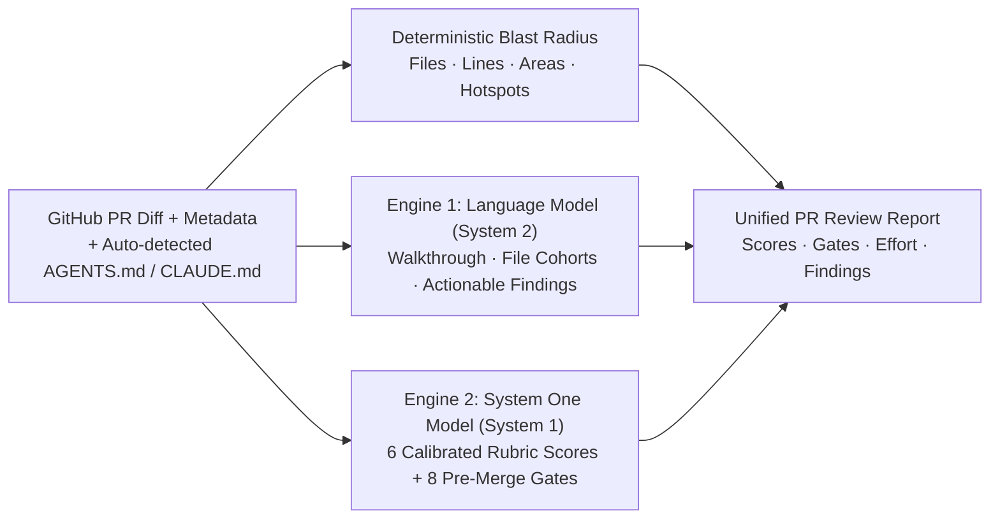

<div align="center">

<p align="center">
  
</p>

# 🦦 CodeOtter

### Autonomous, self-hosted AI code reviews, calibrated scoring gauges, and merge gates — running on your own hardware with any open model.

<p align="center">
  <a href="#-quickstart"><strong>Quickstart</strong></a> &middot;
  <a href="#what-is-codeotter"><strong>What is CodeOtter</strong></a> &middot;
  <a href="#-how-it-works-the-dual-engine"><strong>Dual Engine</strong></a> &middot;
  <a href="#-100-offline-mode-zero-cloud"><strong>Offline Mode</strong></a> &middot;
  <a href="#-docker-deployment"><strong>Docker</strong></a> &middot;
  <a href="#-security--privacy"><strong>Security & Privacy</strong></a> &middot;
  <a href="#-star-history"><strong>Star History</strong></a>
</p>

<p align="center">
  <a href="LICENSE"></a>
  <a href="package.json"></a>
  <a href="#-security--privacy"></a>
  <a href="#what-is-codeotter"></a>
  <a href="#-100-offline-mode-zero-cloud"></a>
  <a href="https://star-history.com/#dharmeshgurnani/CodeOtter&Date"></a>
</p>

</div>

---

## What is CodeOtter?

**CodeOtter** is an open-source, self-hosted pull request review platform designed for engineering teams who demand deep code intelligence without compromising privacy or paying thousands in monthly SaaS subscriptions.

Commercial hosted review bots charge **$24–$30/developer/month** and require continuous third-party cloud access to your private codebase. Meanwhile, standard AI prompts piped to `git diff` produce wall-of-text hallucinations and uncalibrated scores.

CodeOtter solves this with a **parallel dual-engine architecture**:
1. **Deterministic System 1 Engine**: Evaluates 6 calibrated rubric scores and enforces 8 pre-merge policy gates.
2. **Deep System 2 Engine**: Generates concise executive summaries, cohort file walkthroughs, and severity-ranked actionable findings.

Run it 100% offline on your laptop with open-weight models, or connect it to your preferred AI API provider.

<br/>

<div align="center">
  <video src="assets/videos/codeotter-cinematic-film-silent.mp4" poster="assets/videos/codeotter-cinematic-film-poster.png" autoplay loop muted playsinline controls width="100%" style="max-width: 960px; border-radius: 12px;">
    <a href="assets/videos/codeotter-cinematic-film-silent.mp4">
      
    </a>
  </video>
</div>

<br/>

| Step | Action | Description |
| :---: | :--- | :--- |
| **01** | **Connect Repository** | Auto-detects `AGENTS.md` and `CLAUDE.md` guidelines at the repository root. |
| **02** | **Dual Engine Review** | System 1 computes rubric scores & merge gates in parallel with System 2 cohort walkthroughs. |
| **03** | **Enforce, Comment & Merge** | Automatically post System 1 scores and/or the review summary (with a link to the full CodeOtter report) as GitHub PR comments (`gh pr comment`), inspect blast-radius hotspots, and clear the merge gate. |

<br/>

<div align="center">
<table>
  <tr>
    <td align="center"><strong>Works<br/>with</strong></td>
    <td align="center"><br/><sub>GitHub PRs</sub></td>
    <td align="center"><br/><sub>Claude</sub></td>
    <td align="center"><br/><sub>OpenAI</sub></td>
    <td align="center"><br/><sub>Ollama</sub></td>
    <td align="center"><br/><sub>OpenRouter</sub></td>
    <td align="center"><br/><sub>Docker</sub></td>
    <td align="center"><br/><sub>gh CLI</sub></td>
    <td align="center"><br/><sub>REST API</sub></td>
  </tr>
</table>

<em>Run with 100% offline local open weights, hosted model APIs, or private endpoints.</em>

</div>

---

## CodeOtter is right for your team if

- ✅ You want **enterprise-grade PR reviews** without sending private code to a third-party cloud
- ✅ You want **calibrated 0–100 scores and deterministic gates**, not hallucinated guesses
- ✅ You want to **enforce team conventions** (`AGENTS.md` / `CLAUDE.md`) automatically on every PR
- ✅ You want to run **100% offline on local hardware** (MacBook, Linux workstation, air-gapped GPU)
- ✅ You want **zero per-seat billing** ($0 forever for self-hosting)
- ✅ You want an **instant, zero-dependency deployment** with Docker or lightweight Node

---

## ⚡ Quickstart

### Local Setup (Requires Node 20.11+ & pnpm)

Ensure the **GitHub CLI (`gh`)** is authenticated (`gh auth status`):

```bash
# 1. Clone the repository
git clone https://github.com/dharmeshgurnani/CodeOtter.git
cd CodeOtter

# 2. Build and launch
pnpm run build
pnpm start
```

Open **`http://localhost:4747`** in your browser:
1. Paste any GitHub PR URL or select from your active repositories in the sidebar.
2. Select your AI provider under **Settings → Model provider** (or download a 100% offline local model under **Admin → Local models**).
3. Get a calibrated review report in seconds—or query `/api/score?pr=<url|number>` for JSON.

---

## 🧠 How It Works: The Dual Engine

<p align="center">
  
</p>

Asking a single chat LLM to both generate nuanced code critiques *and* output calibrated numeric scores fails in practice: chat models cluster every score between `75` and `85` and significantly slow down generation.

CodeOtter separates review into **two specialized engines that run concurrently**:



### 1. Language Model (System 2 — Prose & Cohorts)
Produces the human-readable review narrative:
- **Executive Walkthrough**: High-level context of what changed and why.
- **File Cohorts**: Groups related file modifications into logical review units.
- **Actionable Findings**: Severity-ranked issues (`⚠️ High / Major`, `⚠️ Medium / Minor`, `🛠️ Low / Refactor`, `🧹 Nitpick`).

### 2. System One Model (System 1 — Typed Scores & Merge Gates)
Evaluates structured rubrics and merge-policy criteria in a single lightning-fast pass:
- **6 Calibrated Scores (`0–100`)**: `Quality`, `Blast Radius`, `Correctness Risk`, `Test Coverage`, `Readability`, and `PR Hygiene`.
- **8 Pre-Merge Policy Gates**: `Title check`, `Description check`, `Security` (injection, auth bypass, secrets, SSRF, XSS), `Complexity`, `Tests`, `Documentation`, `Scope`, and `Repository guidelines` (`AGENTS.md` / `CLAUDE.md` compliance).

*Both engines run in parallel; reviews take only as long as the slowest pass. Either engine can also operate standalone.*

---

## 💻 100% Offline Mode (Zero Cloud)

<p align="center">
  
</p>

Review proprietary code on an airplane or within an air-gapped data center with **zero network requests leaving your machine**.

With 1-click downloads directly from **Admin → Local models**, open-weight models download with optimized local runtimes:

| Model | Engine Role | Ideal For | Hugging Face |
| :--- | :--- | :--- | :--- |
| **Laya Typed-Decisions** | System 1 (Scores & Gates) | Instant rubric scoring & gate checks | [`mys/laya-typed-decisions-GGUF`](https://huggingface.co/mys/laya-typed-decisions-GGUF) |
| **Kev** | System 1 (Scores & Gates) | High-confidence decision calibration | [`mys/kev-0.8b-GGUF`](https://huggingface.co/mys/kev-0.8b-GGUF) |
| **Qwen2.5-Coder (Compact)** | System 2 (Prose & Walkthrough) | Fast local walkthroughs on laptops | [`Qwen/Qwen2.5-Coder-1.5B-Instruct-GGUF`](https://huggingface.co/Qwen/Qwen2.5-Coder-1.5B-Instruct-GGUF) |
| **Qwen2.5-Coder (Standard)** | System 2 (Prose & Walkthrough) | In-depth code critiques & findings | [`Qwen/Qwen2.5-Coder-7B-Instruct-GGUF`](https://huggingface.co/Qwen/Qwen2.5-Coder-7B-Instruct-GGUF) |
| **Microsoft CodeReviewer** | System 2 (Hunk Findings) | Specialized diff-hunk comment generation | [`microsoft/codereviewer`](https://huggingface.co/microsoft/codereviewer) |

- **Smart Resource Management**: Local model runtimes spin up on-demand on the first review and automatically shut down after **15 idle minutes** to conserve memory and battery.
- **Hardware Acceleration**: Automatic GPU detection with seamless CPU fallback ensures smooth execution on everything from developer laptops to dedicated servers.
- **Intelligent Context Optimization**: Diffs and questions are dynamically formatted to match model context windows for high-speed, reliable local inference.

---

## 🛡️ Auto-Detected `AGENTS.md` & `CLAUDE.md` Enforcement

<p align="center">
  
</p>

Every repository onboarded in CodeOtter is automatically inspected at its root via the GitHub API for `AGENTS.md` and/or `CLAUDE.md`.
- **Zero Configuration**: When either (or both) files exist, team guidelines are automatically injected into the review context.
- **Enforced at the Merge Gate**: Violations of architecture conventions, file structures, or coding guidelines trigger warnings in the `Repository guidelines` merge gate.
- **Per-Repository Controls**: Toggle guideline enforcement per repository anytime with a single click.

---

## 🐳 Docker Deployment

A production-ready Docker container packages the complete CodeOtter platform—including persistent storage, team auth, and model runners. Deploy anywhere that runs a container (Docker Compose, Railway, Fly.io, Render, Coolify, or a bare VPS).

```bash
# 1. Prepare environment
cp .env.example .env       # Set GH_TOKEN and optional model keys

# 2. Launch with Compose
docker compose up -d       # Dashboard available on http://localhost:4747
```

Or run standalone:

```bash
docker build -t codeotter .
docker run -d -p 4747:4747 -p 8090:8090 --env-file .env -v codeotter-data:/app/pb_data codeotter
```

- `GH_TOKEN` authenticates `gh` inside the container without interactive prompts.
- Mount `/app/pb_data` as a volume to persist reviews, settings, and downloaded local models across upgrades.

---

## 🏢 Multi-Organization & Team Management

<table>
<tr><td width="30%"><b>Organization Scoping</b></td><td>Switch between teams and organizations seamlessly from the header dropdown. All dashboards, open PR queues, and settings remain isolated.</td></tr>
<tr><td><b>1-Click GitHub App Setup</b></td><td>Under <b>Admin → OAuth</b>, click <i>"Create GitHub app for me"</i> to configure OAuth credentials automatically in one step.</td></tr>
<tr><td><b>Role-Based Access (RBAC)</b></td><td>Owner, Admin, and Developer tiers safeguard sensitive model keys and organization settings. The first user to sign in automatically becomes the instance Owner.</td></tr>
<tr><td><b>Zero-Restart Configuration</b></td><td>All provider keys, local models, and repository settings update live through the dashboard without restarting services.</td></tr>
</table>

---

## 🔒 Security & Privacy

- **Zero Telemetry / No Middleman**: Code diffs and metadata never leave your network unless you explicitly configure a hosted AI provider. Zero analytics, zero phone-home calls.
- **Calibrated & Sanitized Outputs**: Model responses are validated, normalized, and sanitized before display, eliminating prompt injections and hallucinated scores.
- **Hardened Access**: Enterprise-grade session security, strict cross-origin protections, and masked credential management protect your infrastructure and repositories.

---

## ⭐ Star History

<p align="center">
  <a href="https://star-history.com/#dharmeshgurnani/CodeOtter&Date">
    <picture>
      <source media="(prefers-color-scheme: dark)" srcset="https://api.star-history.com/svg?repos=dharmeshgurnani/CodeOtter&type=Date&theme=dark" />
      <source media="(prefers-color-scheme: light)" srcset="https://api.star-history.com/svg?repos=dharmeshgurnani/CodeOtter&type=Date" />
      
    </picture>
  </a>
</p>

---

## 📄 License & Community

- **License**: Distributed under the [Elastic License 2.0 (ELv2)](LICENSE) — free to self-host and customize.
- **Contributing**: Contributions and feedback are welcome! Please check out [`CONTRIBUTING.md`](CONTRIBUTING.md) to get started.
